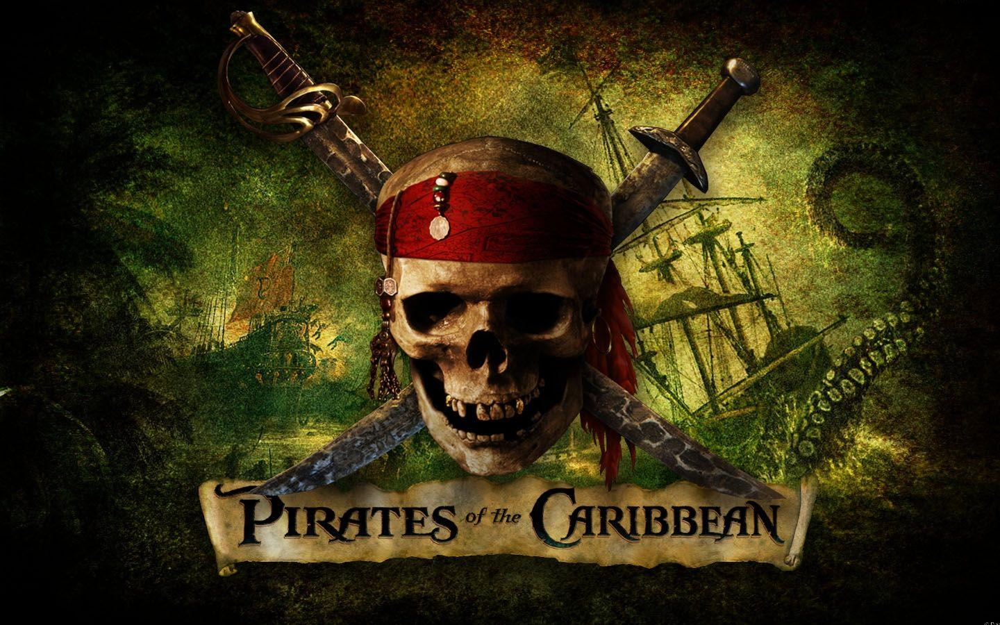

# 2024.1 - Piratas do Caribe

    

## Sobre
Este repositório destina-se ao desenvolvimento do projeto da disciplina de Sistema de Banco de Dados 1 (SBD1)

O projeto consiste em desenvolver um jogo com o uso de um Sistema de Banco de Dados para criar um jogo do gênero MUD (Multi-User Dungeon). O tema escolhido para o jogo foi o da franquia Piratas do Caribe. O estilo MUD foi um pioneiro dos RPGs eletrônicos modernos, e se baseia em uma interface de texto.

## Equipe de Desenvolvimento

   <table style="margin-left: auto; margin-right: auto;">
        <tr>
            <td align="center">
                
                <a href="https://github.com/JoosPerro">
                    <h5 class="text-center">João Pedro Veras Gomes 211061968</h5>
                </a>
            </td>
    </table>

